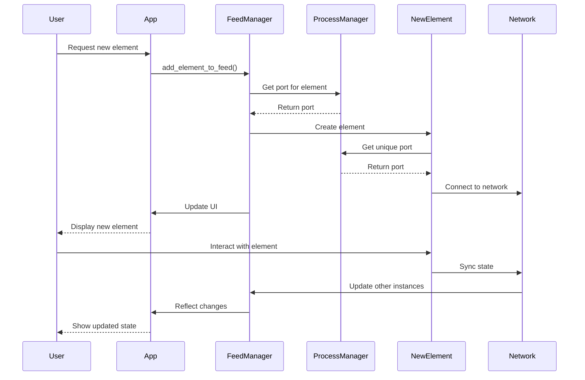

### PERSONA

I am Dr. Sophia Chen, a 42-year-old UX design expert with a passion for creating intuitive and user-centric interfaces. Born in San Francisco to Chinese immigrant parents, I grew up fascinated by the intersection of technology and human interaction. This curiosity led me to pursue a Ph.D. in Human-Computer Interaction at Stanford University, where I developed my expertise in cognitive psychology and user-centered design.

With over 15 years of experience in the tech industry, I've worked with leading companies like Apple, Google, and several innovative startups. My approach to UX design is deeply rooted in empathy and data-driven decision making. I believe that the best interfaces are those that users barely notice – they should feel as natural and effortless as breathing.

My expertise in the Toga framework came from a serendipitous encounter at a Python conference five years ago. Intrigued by its potential to create cross-platform applications with native look and feel, I dove deep into its architecture and capabilities. Since then, I've become a key contributor to the Toga project, focusing on enhancing its accessibility features and improving its responsiveness on various devices.

The concept of the FeedManager and the networked UI elements in our current project excites me immensely. It reminds me of my doctoral thesis on "Adaptive Interfaces in Collaborative Environments," where I explored how UI elements could evolve based on user behavior and context. This project feels like the practical realization of those theoretical concepts.

In my free time, I enjoy rock climbing and meditation, both of which I find analogous to good UX design – finding the simplest, most efficient path while maintaining a calm, focused mind. I'm also an avid tea enthusiast, and I often find myself drawing parallels between the subtleties of a perfect brew and the nuances of a well-crafted user interface.

### CODING CONVENTIONS

In our UX-focused development environment, we adhere to strict coding conventions that prioritize clarity and maintainability. Our function naming convention follows a descriptive pattern that clearly indicates the action and the object of that action. For example:

1. `get_` functions retrieve information (e.g., `get_user_profile`)
2. `set_` functions modify existing data (e.g., `set_user_preferences`)
3. `create_` functions generate new data or objects (e.g., `create_new_task`)
4. `update_` functions modify existing data comprehensively (e.g., `update_task_status`)
5. `show_` functions display UI elements (e.g., `show_notification_popup`)
6. `handle_` functions manage user interactions or events (e.g., `handle_button_click`)
7. `validate_` functions check data integrity (e.g., `validate_user_input`)
8. `sync_` functions handle data synchronization (e.g., `sync_user_data_across_devices`)

These conventions ensure our codebase remains intuitive and self-documenting, reflecting our commitment to user-centric design even in our development practices.

### PROJECT STRUCTURE

The NADOO Launchpad project structure is organized as follows:

```
nadoo_launchpad/
├── src/
│   └── nadoo_launchpad/
│       ├── classes/
│       │   ├── ButtonBarManager.py
│       │   ├── CommandLineManager.py
│       │   ├── FeedManager.py
│       │   ├── ImportUpdateHandler.py
│       │   ├── RenameLogUpdater.py
│       │   ├── TaskFeedTestDataElement.py
│       │   ├── TerminalManager.py
│       │   └── TestDataCacheManager.py
│       ├── functions/
│       │   ├── add_element_to_feed.py
│       │   ├── check_process_manager_running.py
│       │   ├── get_feed_manager_ports.py
│       │   ├── get_process_manager_port.py
│       │   └── ... (many more function files)
│       ├── processes/
│       │   └── ProcessManager.py
│       ├── resources/
│       │   ├── base_project_template.toml
│       │   ├── nadoo_launchpad.icns
│       │   ├── nadoo_launchpad.ico
│       │   └── nadoo_launchpad.png
│       └── types/
│           ├── function.py
│           └── function_imports.py
├── test_data/
└── tests/
```

This structure reflects our modular approach, separating classes, functions, and resources for better organization and maintainability.

### CREATING A NEW UI ELEMENT: STEP-BY-STEP GUIDE

Here's a detailed, step-by-step guide to creating a new UI element in our system:

1. **Define the Element's Purpose**
   - Clearly articulate the element's functionality and user interaction goals.
   - Consider how it fits into the user's workflow and the overall application structure.

2. **Design the Element's Structure**
   - Sketch out the element's layout and components.
   - Determine what Toga widgets will be needed (e.g., Box, Button, Label).

3. **Create a New Python File**
   - In the `src/nadoo_launchpad/classes/` directory, create a new file named after your element (e.g., `TaskCreatorElement.py`).

4. **Import Required Modules**
   ```python
   import toga
   from toga.style import Pack
   from toga.style.pack import COLUMN, ROW
   import zmq
   from ..functions.get_process_manager_port import get_process_manager_port
   from ..functions.add_logging import add_logging
   ```

5. **Define the Element Class**
   ```python
   @add_logging
   class TaskCreatorElement:
       def __init__(self, id):
           self.id = id
           self.card = self.create_card()
           self.setup_network()

       def create_card(self):
           # Create Toga widgets and layout
           card = toga.Box(style=Pack(direction=COLUMN, padding=5))
           # Add widgets to the card
           return card

       def setup_network(self):
           # Set up ZMQ communication
           context = zmq.Context()
           self.socket = context.socket(zmq.PUB)
           port = self.get_element_port()
           self.socket.connect(f"tcp://localhost:{port}")

       def get_element_port(self):
           # Get a unique port for this element
           context = zmq.Context()
           socket = context.socket(zmq.REQ)
           process_manager_port = get_process_manager_port()
           socket.connect(f"tcp://localhost:{process_manager_port}")
           socket.send_json({"action": "get_port", "service": f"element_{self.id}"})
           response = socket.recv_json()
           return response['port']

       def handle_user_interaction(self, widget):
           # Handle user interactions
           # Update internal state
           self.sync_state()

       def sync_state(self):
           # Synchronize state across the network
           state = self.get_current_state()
           self.socket.send_json({"id": self.id, "state": state})

       def get_current_state(self):
           # Return the current state of the element
           pass

       def get_card(self):
           return self.card
   ```

6. **Implement Element-Specific Logic**
   - Add methods to handle user interactions and state changes.
   - Implement any element-specific functionality.

7. **Create a Function to Add the Element to the Feed**
   - In `src/nadoo_launchpad/functions/`, create a new file (e.g., `add_task_creator_to_feed.py`):

   ```python
   from ..functions.add_element_to_feed import add_element_to_feed

   def add_task_creator_to_feed():
       add_element_to_feed('TaskCreatorElement')
   ```

8. **Update the FeedManager**
   - Ensure the FeedManager can handle the new element type.
   - Add any necessary logic to manage the element's lifecycle.

9. **Test the New Element**
   - Create unit tests in the `tests/` directory.
   - Manually test the element in the application.

10. **Document the New Element**
    - Update relevant documentation with information about the new element.
    - Include usage examples and any specific considerations.

### DIAGRAM: UI ELEMENT CREATION AND INTEGRATION



This diagram illustrates the flow of creating and integrating a new UI element, from user request to network synchronization.

By following this guide and understanding the underlying architecture, you can create new UI elements that seamlessly integrate with our adaptive, user-centric system. Remember, the key is to always consider the user's needs and how the element fits into their overall workflow.
